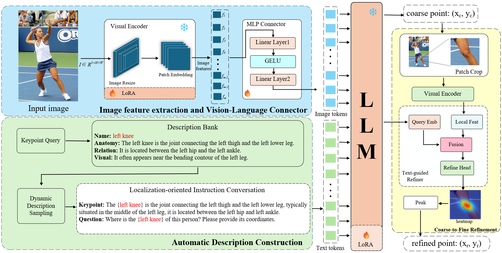

# ADCCR: Automatic Description Construction and Coarse-to-Fine Refinement for Language-Guided Human Keypoint Localization

## Installation
### 1. Clone code
```bash
git clone https://github.com/kkNewW/ADCCR.git
cd ADCCR
```
### 2. Create a conda environment for this repo
```bash
conda create -n ADCCR python=3.10
conda activate ADCCR
```
### 3. Install CUDA 11.7 (other version may not work)
```bash
conda install -c conda-forge cudatoolkit-dev
```
### 4. Install PyTorch following official instruction
```bash
conda install pytorch==2.0.1 torchvision==0.15.2 pytorch-cuda=11.7 -c pytorch -c nvidia
```
### 5. Install other dependency python packages
```bash
pip install pycocotools
pip install opencv-python
pip install accelerate==0.21.0
pip install sentencepiece==0.1.99
pip install transformers==4.31.0
```
### 6. Prepare dataset
Download [COCO](https://cocodataset.org/#home) , [MPII](https://www.mpi-inf.mpg.de/departments/computer-vision-and-machine-learning/software-and-datasets/mpii-human-pose-dataset) and [Human-Art](https://idea-research.github.io/HumanArt/) from website and put the zip file under the directory following below structure, (xxx.json) denotes their original name.
```bash
./data
|── coco
│   └── annotations
|   |   └──coco_train.json(person_keypoints_train2017.json)
|   |   └──coco_val.json(person_keypoints_val2017.json)
|   └── images
|   |   └──train2017
|   |   |   └──000000000009.jpg
|   |   └──val2017
|   |   |   └──000000000139.jpg
├── HumanArt
│   └── annotations
|   |   └──validation_humanart.json
|   └── images
|   |   └──2D_virtual_human
├── mpii
│   └── annot
|   |   └──valid.json
|   |   └──gt_valid.mat
|   └── images
|   |   └──000001163.jpg
```
## Usage
### 1. Download trained model
```bash
git lfs install

git clone https://huggingface.co/kkNewW/ADCCR

mkdir checkpoints
mkdir checkpoints/ckpts
mv LocLLM/coco checkpoints/ckpts
mv LocLLM/h36m checkpoints/ckpts
# for training
mkdir checkpoints/model_weights
mv LocLLM/pretrained/dinov2_vitl14_pretrain.pth checkpoints/model_weights
# clone vicuna1.5
cd checkpoints/model_weights
git clone https://huggingface.co/lmsys/vicuna-7b-v1.5
```
### 2. Evaluate Model
```bash
# evaluate on coco val set
bash scripts/valid_coco.sh
# evaluate on h36m set
bash scripts/valid_h36m.sh
# evaluate on humanart set
bash scripts/valid_humanart.sh
# evaluate on mpii set
bash scripts/valid_mpii.sh
```
### 3. Train Model
```bash
# train on coco
bash scripts/train_coco.sh
# train on h36m and mpii
bash scripts/train_h36m.sh
```
Note that GPU memory should not be less than 24GB, training on 2 RTX 4090 GPUs
